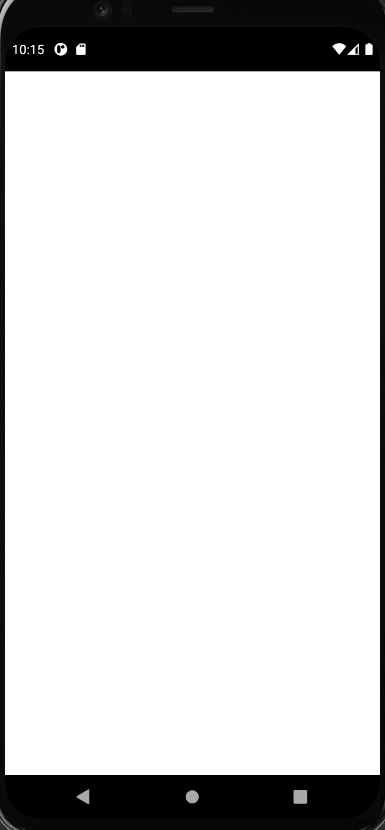

# Post Api App

## Sobre o Projeto:
Aplicativo que exibe dados de uma API.

Projeto visa praticar acesso de uma api e exibir dados na tela.

  

## Requisitos
- Flutter versão: 2.2.2
- Channel: stable
- Dart: 2.13.3 (stable)
